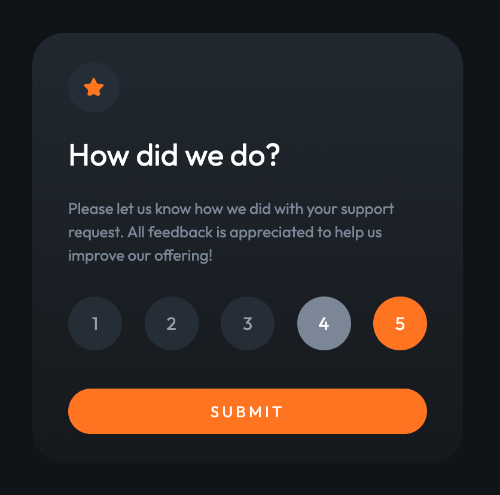

# Frontend Mentor - Interactive rating component solution

This is a solution to the [Interactive rating component challenge on Frontend Mentor](https://www.frontendmentor.io/challenges/interactive-rating-component-koxpeBUmI). Frontend Mentor challenges help you improve your coding skills by building realistic projects.

## Table of contents

- [Overview](#overview)
  - [The challenge](#the-challenge)
  - [Screenshot](#screenshot)
  - [Links](#links)
- [My process](#my-process)
  - [Built with](#built-with)
  - [What I learned](#what-i-learned)
- [Author](#author)

## Overview

### The challenge

Users should be able to:

- View the optimal layout for the app depending on their device's screen size
- See hover states for all interactive elements on the page
- Select and submit a number rating
- See the "Thank you" card state after submitting a rating

### Screenshot



### Links

- Solution URL: [Add solution URL here](https://your-solution-url.com)
- Live Site URL: [Add live site URL here](https://your-live-site-url.com)

## My process

### Built with

- Semantic HTML5 markup
- CSS custom properties
- Flexbox
- Mobile-first workflow
- [React](https://reactjs.org/) - JS library

### What I learned

- State management with useState and passing props from parent to child components.
- Conditional rendering.

CSS Custom properties

```css
:root {
  --white: hsl(0, 0%, 100%);
  --light-grey: hsl(217, 12%, 63%);
  --medium-grey: hsl(216, 12%, 54%);
  --dark-blue: hsl(213, 19%, 18%);
  --very-dark-blue: hsl(216, 12%, 8%);
  --orange: hsl(25, 97%, 53%);
}
```

Pattern to render lists in React

```js
{
  [1, 2, 3, 4, 5].map((rating) => (
    <button key={rating} type="button" onClick={() => setSelectedRating(rating)} className="btn">
      {rating}
    </button>
  ));
}
```

## Author

- Frontend Mentor - [@mbalinoftw](https://www.frontendmentor.io/profile/mbalinoftw)
- GitHub - [@mbalinoftw](https://github.com/mbalinoftw)
